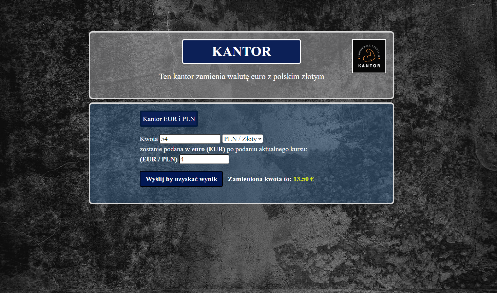

<h1>Cantor </h1>

Site "cantor" is there:  
https://lukaswebdeveloper.github.io/cantor/

<h2> Icon page</h2>
    

<h2>DEMO page CANTOR</h2>
    

<h2>Description</h2>

<b>hour: 16:30, date: 09.02.2023</b>  In file index.html I created     "basic template", add file style.css and add file script.js, and add file photo icon page, and add file photo background

<b>hour: 17:23</b>, <b>date: 09.02.2023</b>   In this description added icon page.

<b>hour: 16:40, date: 09.02.2023</b>  complete html page code. normalize.css CSS file added. I have completed this CSS code to give the whole look of the exchange website

<b>hour: 21:30, date: 09.02.2023</b>  I modified and finished the appearance of the exchange office's website, added a page icon to it, added the technologies used here in the description below

<b>hour: 17:40, date: 09.02.2023</b>   script.js - code corrected after, index.html - code corrected after, iconPage added, style.css - corected finished, 

<h2>Used Technologies</h2>

<ul>
    <li>
        HTML
    </li>
    <li>
        CSS
    </li>
    <li>
        JAVASCRIPT
    </li>
    <li>
        BEM
    </li>
</ul>